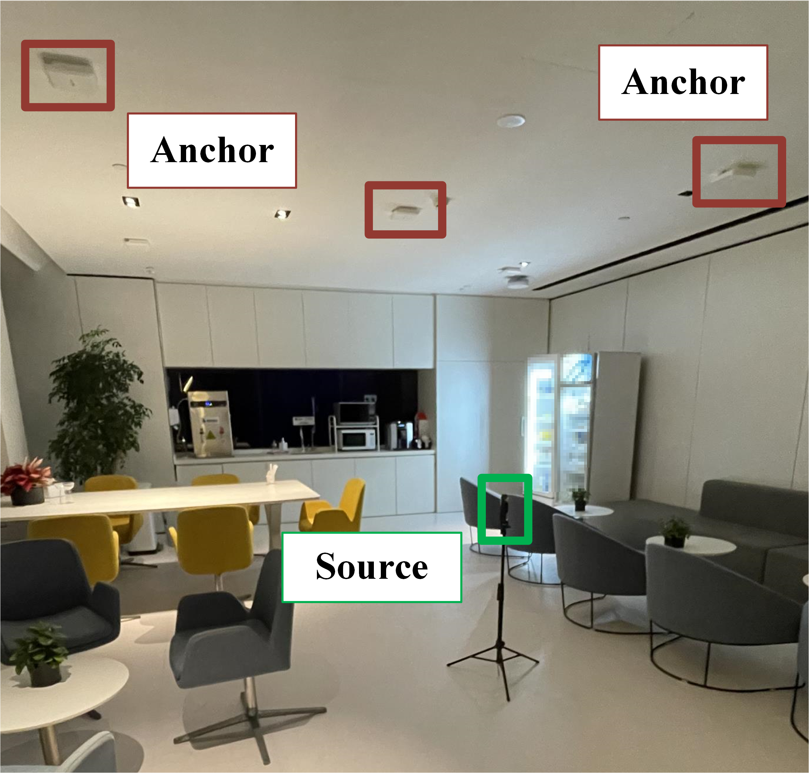
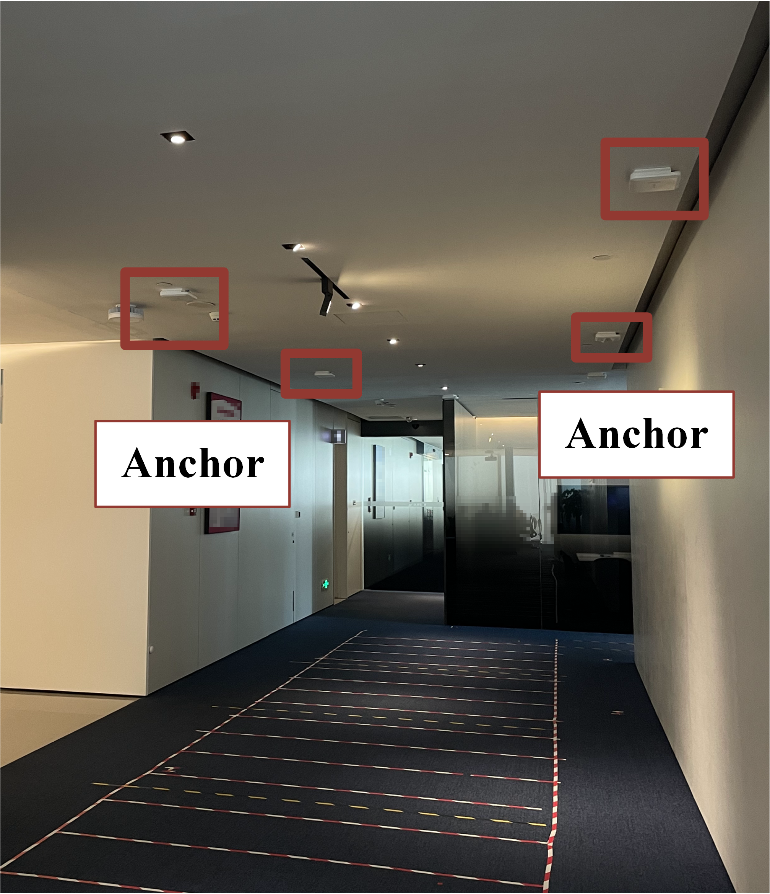

# Indoor-3d-Direct-Positioning

[](https://opensource.org/licenses/MIT)
[](https://www.mathworks.com)

MATLAB implementation of a 3D direct positioning algorithm featuring dynamic grid adaptation for enhanced indoor localization accuracy.

## Key Features
- **Direct Positioning**: integrating AOA-TOA features
- **Adaptive Gird Refinement**: Automatic grid refinement from 1.0m-level to 0.1m-level resolution
- **Signal Support**: Processes Bluetooth Low Energy (BLE) input

## Experimental Indoor Scenarios
### Breakroom Environment (8m × 6.5m × 3m)

- **Anchor Configuration**: 5 BLE anchors
- **Obstacles**: cabinets, glass, walls

### Anterroom Environment (10m × 4m × 3m)

- **Anchor Configuration**: 4 BLE anchors

## Getting Started
### Prerequisites
- MATLAB R2023a or later

### Basic Example

## Citation (To be updated)
```bibtex
@inproceedings{author2024indoor,
  title={An Enhanced 3-D Direct Positioning Method with Adaptive Grid Refinement in Indoor Environments},
  author={Author, J. and Coauthors},
  booktitle={Proceedings of XXX},
  year={2024}
}
```

## License
This project is licensed under the MIT License - see the LICENSE file for details.

This implementation is part of ongoing research submitted to a conference. Technical details and performance metrics will be updated after the peer-review process. For collaboration inquiries, please contact [Jenny_e@sjtu.edu.cn].


